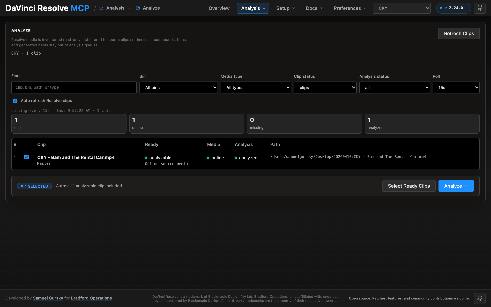
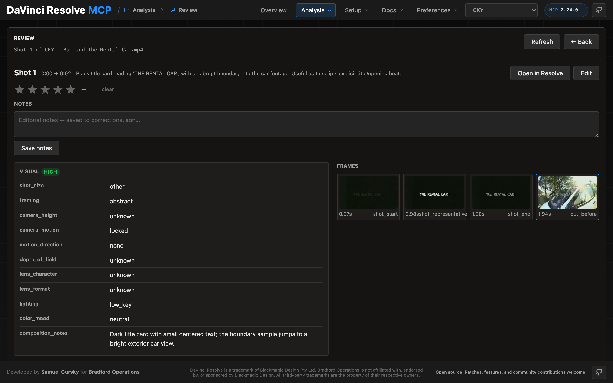
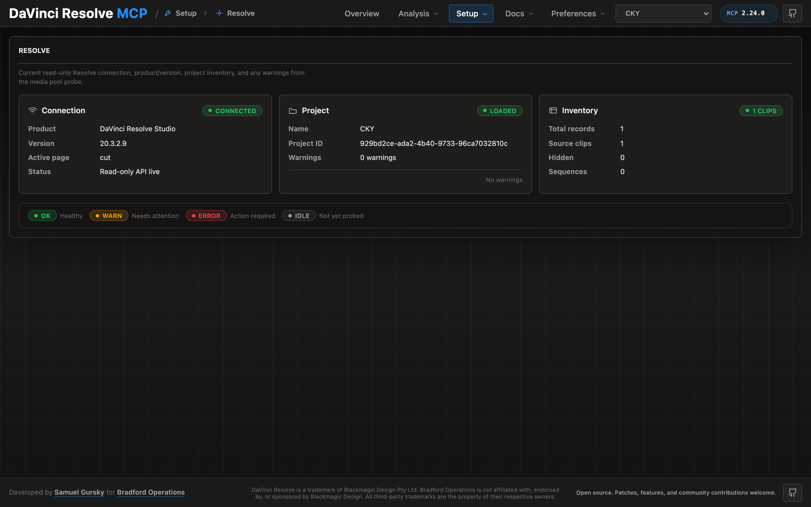
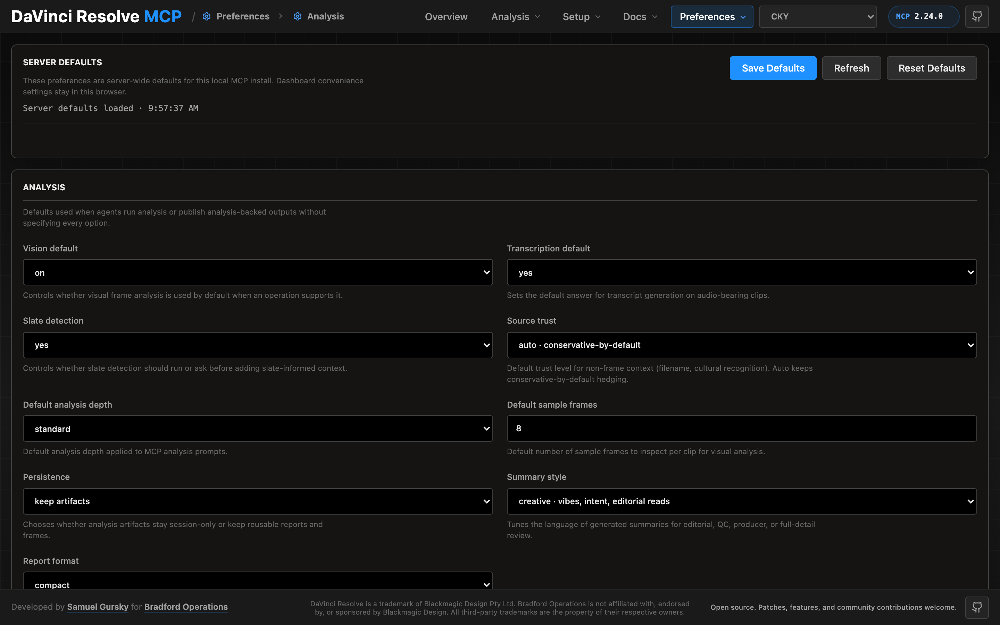

# Local Control Panel

The DaVinci Resolve MCP ships with a local, single-user browser control panel for
inspecting Resolve state, running source-safe media analysis, drilling into
analyzed clips and shots, fixing analysis output inline, and managing
preferences.

The panel is a local HTTP server (default `http://127.0.0.1:8765`). It does not
expose a network listener beyond loopback and does not modify source media.

## Launching the panel

```bash
# From source
venv/bin/python -m src.control_panel

# From the npm package
npx davinci-resolve-mcp control-panel

# From a chat client via MCP
resolve_control(action="open_control_panel")
```

Once running, you can `resolve_control(action="control_panel_status")` to check
the pidfile or `resolve_control(action="close_control_panel")` to stop it.

## Tour

### Overview


The Overview tab is the at-a-glance summary for the active project: Resolve
connection state, source clip counts, analysis progress, search index size,
and the source-media safety status.

### Analysis → Analyze



The Analyze view inventories the Resolve media pool read-only and lets you
queue source-safe analysis jobs. Filters cover bin, media type, clip status,
and analysis status. Resolve media stays read-only; analysis outputs land under
the configured analysis root.

### Analysis → Review (bin grid)


The Review surface is the browser for analyzed clips. Each card shows a
representative thumbnail, summary one-liner, primary use, shot count, and tags.
Click into a card to drill down.

### Clip detail


The clip view shows the full summary, tags, editorial notes, and a strip of
every detected shot with thumbnails. From here you can open the clip in
Resolve, jump to the transcript, or click into any shot for the full V2 field
breakdown.

### Shot detail with inline correction



The shot view shows every V2 schema field (shot size, framing, camera height,
motion direction, lens character, lighting, composition notes, and more)
alongside the frames the vision pass actually saw. Each subjective field is
editable inline — edits land in `corrections.json` with an append-only
changelog and are merged on top of the next re-analysis so human notes survive
fresh vision runs. `Open in Resolve` bounces you straight to the clip in the
source viewer with the shot's mark in/out set.

### Setup → Resolve diagnostic



The Resolve diagnostic page reports the live connection, product/version,
active page, project identity, and media pool inventory. Useful when chat
sessions need to confirm Resolve is reachable before issuing scripted
operations.

### Preferences → Analysis



Server-wide analysis defaults: vision on/off, transcription default, slate
detection, source-trust grading (`auto` / `filename` / `low` / `medium` /
`high`), default analysis depth, default sample frame count, persistence
behavior, summary style, and report format. These are the defaults the
`analyze_media` prompt uses when not overridden per call.

## Chat ↔ panel state sharing

The panel and chat share focus state through `panel_state.json` (under the
active project's analysis root). MCP actions:

- `media_analysis(action="get_panel_state")` — read current focus (project,
  clip, shot)
- `media_analysis(action="set_panel_state", params={...})` — set focus from
  chat
- `media_analysis(action="session_start_context")` — bootstrap a chat session
  with the panel's current focus

The dashboard polls `/api/panel_state` every 2 seconds, so changes from chat
appear in the UI without a refresh.

## Open in Resolve

The shot view and clip view both have an Open-in-Resolve action. Under the
hood this calls `media_pool_item(action="open_in_viewer", params={clip_id,
mark_in, mark_out})`, which selects the clip on the Media page, loads it into
the source viewer, sets mark in/out, and brings Resolve to the foreground via
an OS-level window activation (AppleScript on macOS, PowerShell `AppActivate`
on Windows, wmctrl/xdotool on Linux).

## Re-capturing screenshots

The screenshots in this guide are captured with a small Puppeteer script that
drives the running panel. To re-shoot:

```bash
# In a scratch dir (don't pollute the project)
npm install puppeteer
# Then run a script that navigates each tab and screenshots to
# docs/images/control-panel/. See the project memory for the latest capture
# script.
```

The panel must be running on `127.0.0.1:8765` against an analysis root that
has at least one analyzed clip (otherwise the Review/Clip/Shot screenshots
will be empty).
