# Local Control Panel

The DaVinci Resolve MCP ships with a local, single-user browser control panel
for inspecting Resolve state, running source-safe media analysis, drilling into
analyzed clips and shots, fixing analysis output inline, reviewing timeline
edit history, driving Resolve's local AI operations, and managing preferences.

The panel is a local HTTP server (default `http://127.0.0.1:8765`). It does not
expose a network listener beyond loopback and does not modify source media.

## Launching the panel

```bash
# From source
venv/bin/python -m src.control_panel

# From the npm package
npx davinci-resolve-mcp control-panel

# From a chat client via MCP
resolve_control(action="open_control_panel")
```

Once running, `resolve_control(action="control_panel_status")` checks the
pidfile and `resolve_control(action="close_control_panel")` stops it.

## Navigation and deep links

Top-level sections: **Overview**, **Media** (Inventory / Review / History /
Edit Plans), **AI Console**, **Setup** (Resolve / MCP / Storage / Tools /
Media Pool History), **Docs**, and **Preferences** (Analysis / Caps + Safety /
Metadata and Markers / Paths and Workflow / MCP Updates). The project selector on the
right scopes the panel to an analysis context; **View All Projects** opens a
read-only browser over the Resolve project database with confirm-gated
loading.

Every view is addressable by URL hash, so links can be bookmarked or pasted
into chat:

```
#overview                                  #aiconsole
#analysis/media                            #analysis/review
#analysis/review/history                   #analysis/review/clip/<clip_id>
#analysis/review/clip/<clip_id>/shot/<n>   #analysis/review/clip/<clip_id>/transcript
#analysis/review/plans                     #analysis/review/plans/<plan_id>
#diagnostics/mcp                           #preferences/caps
```

## Tour

### Overview

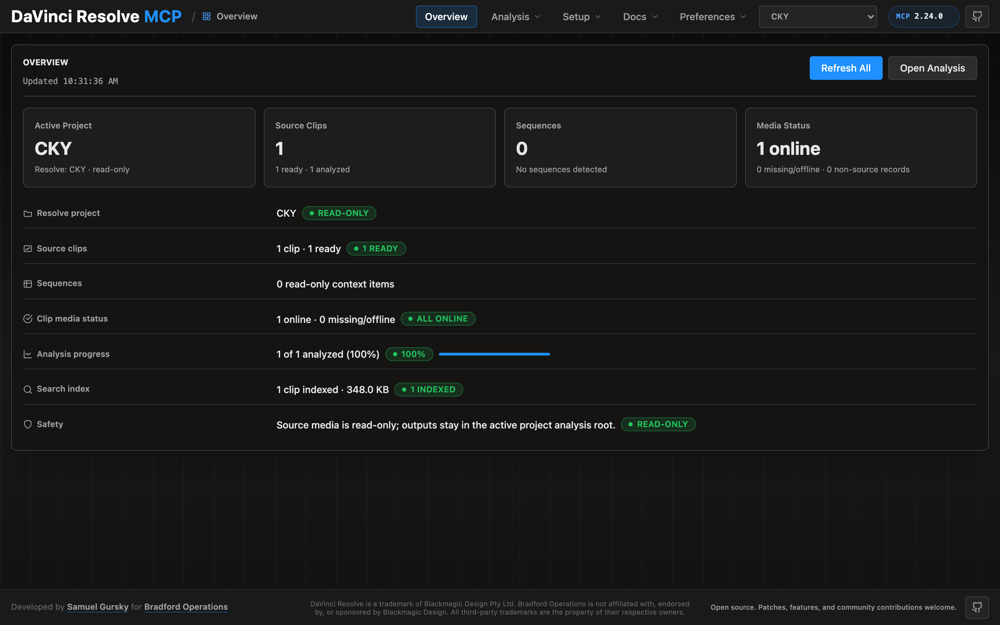

The at-a-glance summary for the active project: Resolve connection state,
source clip counts, analysis progress, search-index status, and the
source-media safety posture. When the project has no source clips yet, the
view shows a get-started card with a suggested chat prompt and a
**Copy prompt** button — the panel is summoned by conversation, and its empty
states point back into it.

### Media → Inventory

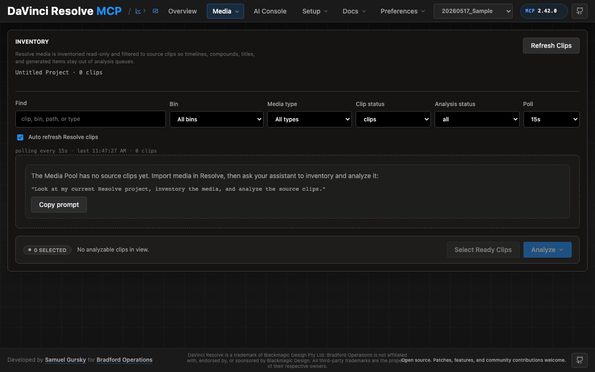

Inventory walks the Resolve Media Pool read-only and filters to source clips so
timelines, compounds, titles, and generated items stay out of analysis queues.
Filters cover bin, media type, clip status, and analysis status, with optional
auto-refresh polling. From here you can select analyzable clips, copy a
ready-made analysis prompt for your chat session, or launch a supported chat
client directly.

### Media → Review

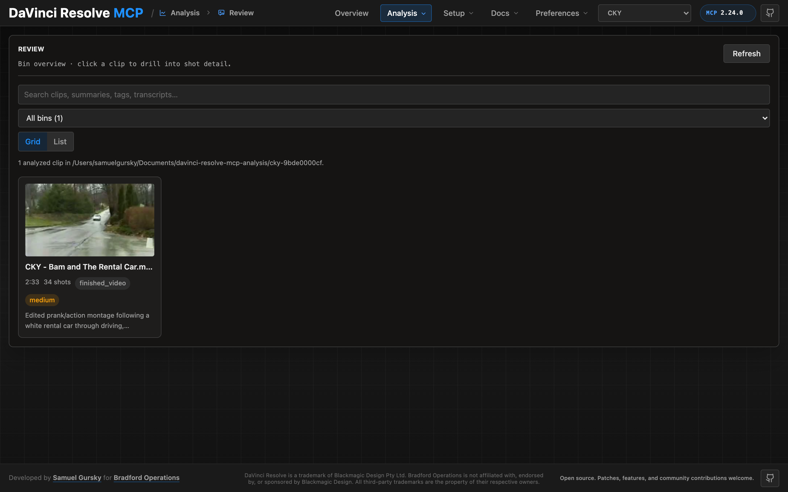

Review is the browser for analyzed clips. The readiness strip summarizes the
evidence base (analyzed / superseded / vision-pending / warnings) with
humanized source-trust and analysis-layer chips. Cards show a representative
thumbnail, duration, shot count, status, and summary one-liner; grid and list
layouts are available, and full-text search covers clips, summaries, tags, and
transcripts once the search index is built. When a local text-embedding
backend is detected (ollama with `nomic-embed-text`, or
sentence-transformers), a `Semantic` toggle appears next to the search box —
it searches by meaning instead of exact words, ranking clips, shots, and
transcript lines by similarity to your query. Once cross-clip entity
detection has run (`detect_entities` + a one-frame-per-cluster confirmation
in chat), a `Recurring across this bin` card lists the labeled people,
places, and objects with their shot counts.

### Clip detail

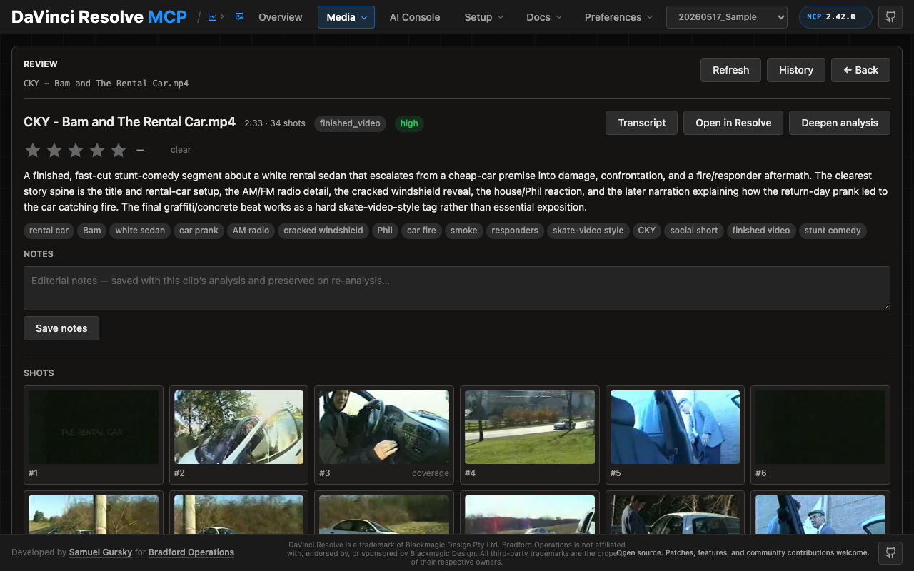

The clip view shows the full summary, tags, star rating, editorial notes, and
a contact sheet of every detected shot. From here you can open the clip in
Resolve, jump to the transcript, or click into any shot. `Deepen analysis`
copies a ready-made chat prompt that asks your MCP session to run the opt-in
deep shot pass (cost estimate first, then per-shot Visual / Content /
Editorial / Cuttability fields).

### Transcript

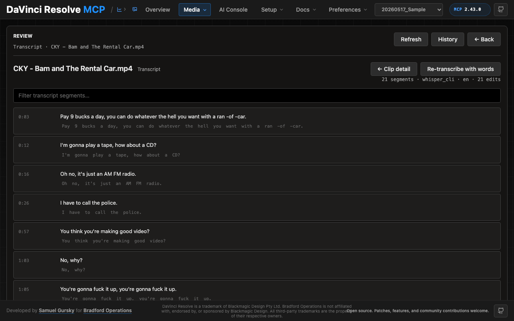

Each segment shows its start time, the cleaned sentence, and the original
machine transcription beneath. Inline edits are preserved across re-analysis,
and `Re-transcribe with words` re-runs the configured local transcription
backend (Whisper by default) without re-doing visual analysis.

### Shot detail with inline correction

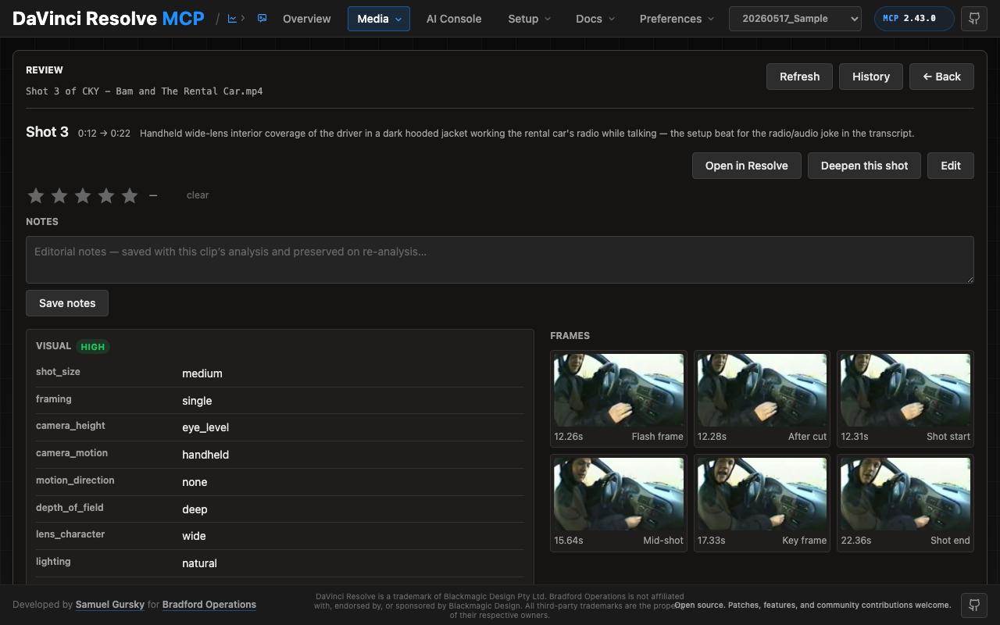

The shot view shows the analysis fields for the shot alongside the frames the
vision pass actually sampled, each labeled with why it was chosen ("Shot
start", "After cut", "Flash frame", "Motion peak"). Subjective fields are
editable inline; edits are kept with the clip's analysis and merged on top of
future re-analysis so human notes survive fresh vision runs. `Open in Resolve`
jumps straight to the clip in the source viewer with the shot's mark in/out
set. The field groups (Visual, Content, Production, Editorial, Cuttability)
are filled by the opt-in deep vision pass — `Deepen this shot` copies a chat
prompt that runs it for just this shot, estimate first. The Relationships
group (same_setup_as / continues_from / alt_take_of) fills from the
cross-shot relationships pass (`detect_shot_relationships` →
vision-confirm → `commit_shot_relationships`); `continues_from` is shown on
the continuing shot.

### Media → History

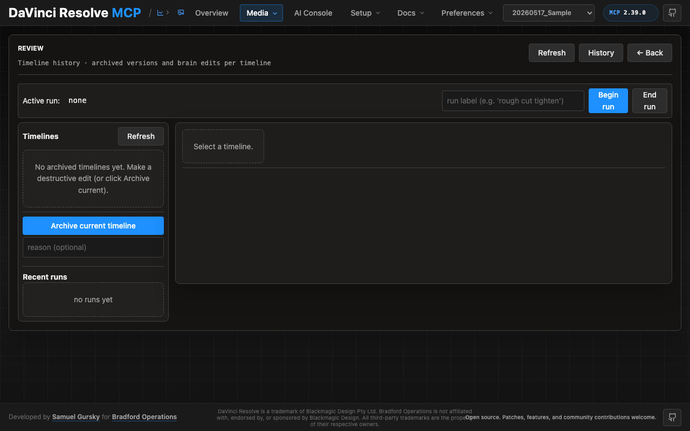

The timeline edit history: archived timeline versions and brain edits per
timeline. Begin/end labeled runs to group related edits, archive the current
timeline before risky work, and select any timeline to inspect its version
chain and the edits between versions. Every destructive timeline edit made
through the MCP archives a version here automatically.

### Media → Edit Plans

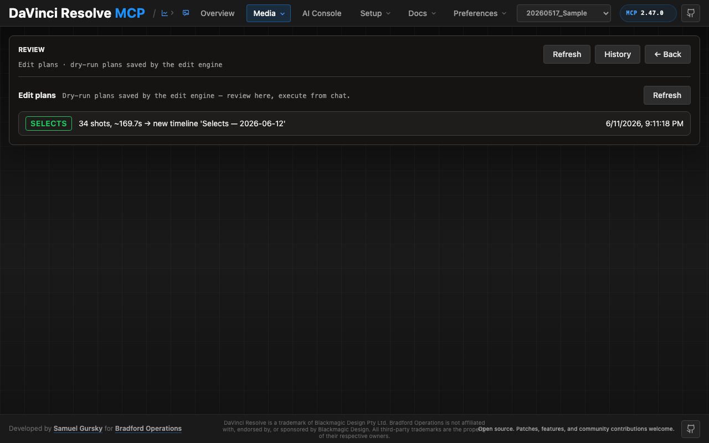

Dry-run plans saved by the edit engine (`edit_engine` actions
`plan_selects` / `plan_tighten` / `plan_swap`). The list shows each plan's
kind, summary, save time, and an `executed` chip once it has run; plans that
fail their fingerprint check appear as a warning row instead of being hidden.
Opening a plan shows its full evidence: selects decisions render with shot
thumbnails, rank, duration, and rationale (with a deep link to each shot
page); tighten plans list every dead-air lift with its transcript-gap
evidence; swap plans show the current item and each numbered alternate with
its similarity score.

The panel never executes a plan. Each detail view carries a copyable chat
prompt (per kind, with the `alternate_index` placeholder for swaps) — paste
it into your MCP chat session, which holds the confirm-token gate and the
versioned execution path. Executed plans keep their execution readback
inline.

### AI Console

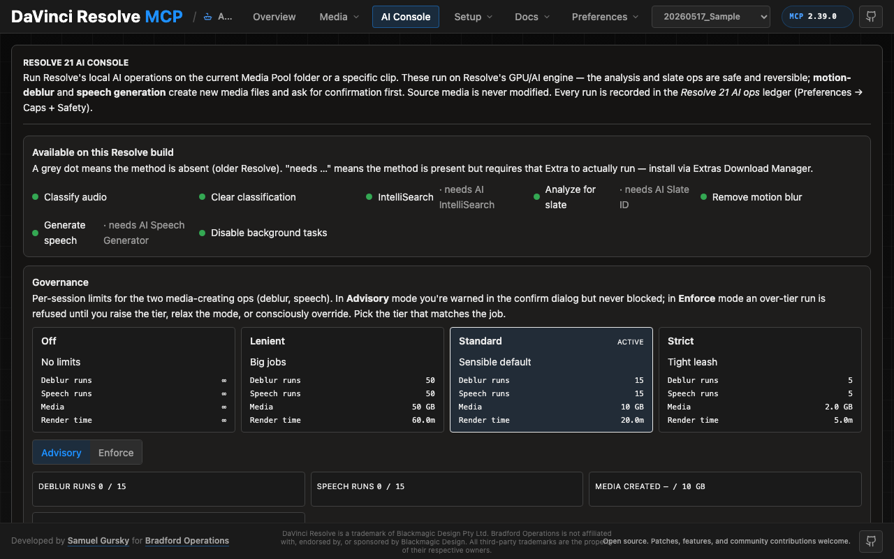

Runs Resolve's local AI operations (audio classification, IntelliSearch, slate
analysis, transcription, motion deblur, speech generation) on the current
Media Pool folder or a specific clip. Capability dots show what this Resolve
build exposes and which AI Extras are required. The **Governance** card sets
the per-session tier (off / lenient / standard / strict) for the two
media-creating ops and the governance **mode**: *Advisory* warns in the
confirm dialog; *Enforce* refuses an over-tier run until you raise the tier,
relax the mode, or consciously override. Usage gauges track runs, media
created, and render time against the active tier, and the AI-ops ledger
(Preferences → Caps + Safety) records every run with the acting instance.

### Setup

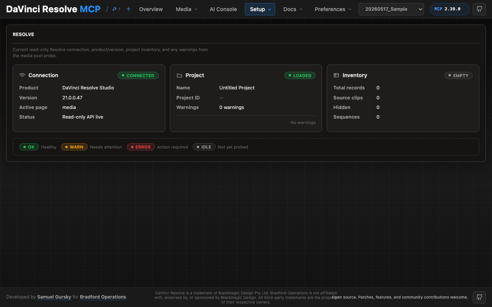

- **Resolve** — live connection, product/version, active page, project
  identity, and Media Pool inventory.
- **MCP** — server identity, detected Resolve scripting paths, transport
  status (with a start button for the networked mode), and per-client install
  status with one-click install/repair for every supported harness.
- **Storage** — the analysis root, search index, and jobs database paths and
  sizes for the active project.
- **Tools** — runtime helpers (ffprobe, ffmpeg, Whisper backends, OpenCV)
  with ready/missing status and copyable install commands.
- **Media Pool History** — the provenance log for destructive media-pool
  operations (deletes, replaces, relinks), kept separate from timeline brain
  edits.

### Preferences

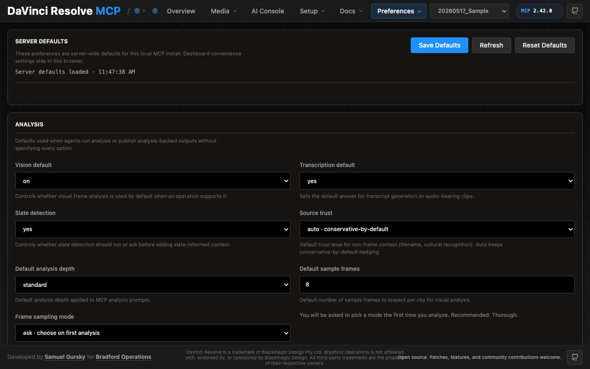

Server-wide defaults for this MCP install (dashboard-only conveniences stay in
the browser):

- **Analysis** — vision/transcription defaults, slate detection, source-trust
  grading, depth, frame-sampling mode, summary style, report format.
- **Caps + Safety** — token and frame budget presets (minimal / standard /
  generous / unlimited) with live usage gauges, per-clip/job/day caps, the
  Resolve AI-ops ledger, and destructive-edit safety rails.
- **Metadata and Markers** — Resolve metadata write-back fields, timed-marker
  defaults, marker types and colors, overwrite policy.
- **Paths and Workflow** — preferred analysis root, generated-media folder,
  post-operation page behavior, and a read-only map of where files live.
- **MCP Updates** — update policy (prompt / notify / auto / never), release
  channel (stable / beta / dev), check cadence, apply/rollback with update
  history.

## Chat ↔ panel state sharing

The panel and chat share focus state through `panel_state.json` (under the
active project's analysis root). MCP actions:

- `media_analysis(action="get_panel_state")` — read current focus (project,
  clip, shot)
- `media_analysis(action="set_panel_state", params={...})` — set focus from
  chat
- `media_analysis(action="session_start_context")` — bootstrap a chat session
  with the panel's current focus

The dashboard polls `/api/panel_state` every 2 seconds while it has focus,
backs off to roughly every 10 seconds when the window is unfocused, and stops
polling entirely while the tab is hidden.

## Open in Resolve

The shot view and clip view both have an Open-in-Resolve action. Under the
hood this calls `media_pool_item(action="open_in_viewer", params={clip_id,
mark_in, mark_out})`, which selects the clip on the Media page, loads it into
the source viewer, sets mark in/out, and brings Resolve to the foreground via
an OS-level window activation (AppleScript on macOS, PowerShell `AppActivate`
on Windows, wmctrl/xdotool on Linux).
