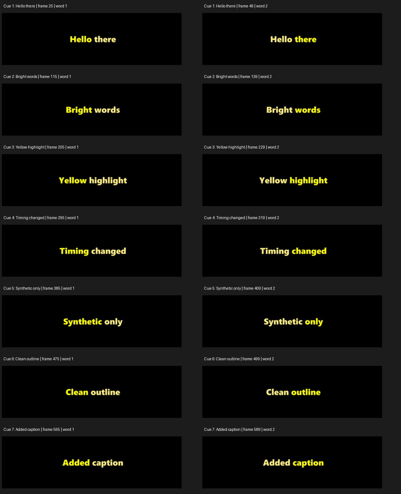

# Synthetic subtitle burn-in acceptance — 2026-10-06

**Passed on DaVinci Resolve Studio 21.1.0.17, Windows.** The tested implementation
matches PR #273 at `0e8bba4334f2340c5e3424e0a656a4e67c44defa` (only documentation and commit-message
privacy cleanup followed the live run; implementation files are identical).

Only generated black video, Windows synthetic speech and invented captions were
used. The native Word Highlight preset was applied in the disposable QA project,
without copying a preset from a personal project. The published evidence contains
rendered synthetic frames and numerical results; no project databases, machine
paths, personal footage or personal captions are included.

## Procedure

1. Generate a 21-second black 1080×1920 / 30 fps video with synthetic English
   speech. Import it into a new local disk project and generate subtitles.
2. Apply **Word Highlight** from the Effects library to subtitle track 1 and save.
3. Preview edits with the advanced `project_db` handler. Save and fully quit
   Resolve. Call `set_subtitle_preset` and `write_captions` with
   `iConfirmProjectClosed:true`. Six captions are replaced, one is deleted and
   one is added. All text and word timings are explicitly supplied.
4. Relaunch Resolve, load the disposable project, and compare live caption text
   and frame bounds with the write result.
5. Load the **H.264 Master** render preset, select MP4/H264 and single-clip mode,
   then set `ExportSubtitle:true`, `SubtitleFormat:"BurnIn"`, 1080×1920, 30 fps,
   video and audio enabled, and all frames. Render, save and check persisted
   caption text, bounds and word timing against the write result.
6. Decode the actual render with FFmpeg and inspect every frame. Inspect the
   readable caption text visually in the contact sheet as a separate check.

Preset controls: Segoe UI / Black, size 0.055, Center `[0.5,0.5]`, white text,
yellow highlight, black outline enabled, thickness 0.1.

## Caption and timing expectations

Frame numbers below are relative to timeline start (absolute start is 108000).
Ends are exclusive. Each caption has two words; the highlight changes at the
listed boundary. These timings deliberately replace the speech generator's
original caption timing, so audio sync is not an acceptance criterion.

| Caption | Start | Word boundary | End |
| --- | ---: | ---: | ---: |
| Hello there | 15 | 39 | 75 |
| Bright words | 105 | 129 | 165 |
| Yellow highlight | 195 | 219 | 255 |
| Timing changed | 285 | 309 | 345 |
| Synthetic only | 375 | 399 | 435 |
| Clean outline | 465 | 489 | 525 |
| Added caption | 555 | 579 | 615 |

## Results and evidence

- Render completed; FFprobe confirmed a 1080×1920 video stream at 30 fps,
  630 frames, plus an audio stream.
- Live caption text and bounds matched all seven edits after a full restart.
- Saved text, bounds and word intervals matched after the render and save.
- All 420 caption frames contained visible pixels; none were blank or clipped.
- No caption pixels appeared in the 210 frames outside the caption intervals.
- In every caption frame, the dominant yellow pixels were in the expected word
  region. All seven transitions matched the boundary exactly, including the
  adjacent frames. This checks the two-word synthetic layout, not arbitrary text.
- All seven caption strings were visually inspected in both highlight states.
  The pixel check alone does not recognize text and is not treated as OCR.

[Numerical frame report](frame-report.json) includes per-frame highlight counts,
caption bounds and the source render's SHA-256. The [56 full-frame samples](frames/)
cover each caption's preceding frame, first two frames, both sides of the word
boundary, final caption frame and following frame. Images were extracted from
the rendered video, not from the Resolve viewer.

The first attempt used a long disposable project name. SQLite snapshot creation
failed before any mutation. Shortening that disposable project's name allowed
the same unmodified handler to complete. Windows snapshot path-length limits
remain a separate issue; this run does not claim to fix them.

The legacy `tests/live_subtitle_roundtrip.py` green-pixel pass flag was not used
as acceptance evidence. Its existing validator cannot establish readable text
or correct per-word timing. This run combines live/saved readback, all-frame
region checks and a separate visual text review.
